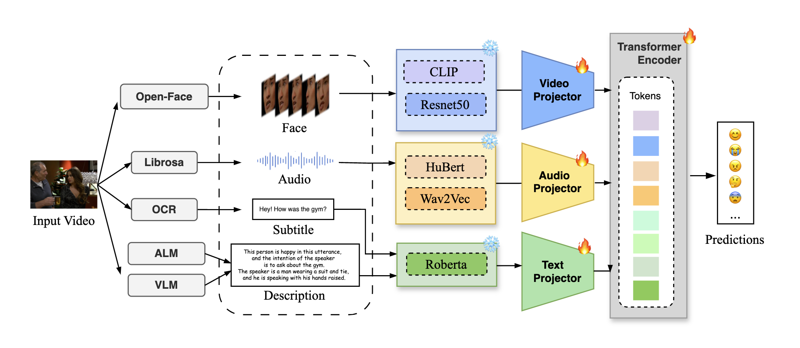
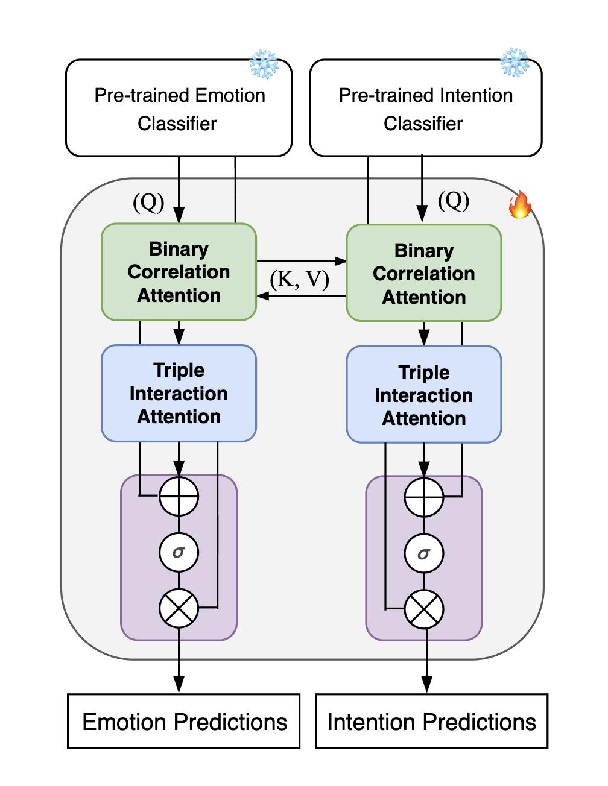

# CS5242-Meiju2025Challenge
GitHub repository for **MEIJU 2025 Grand Challenge** (Track 2)

🏆 **Ranked 11th out of 29 teams** in Track 2

## 📌 About
This repository presents a **multimodal fusion approach** for **emotion and intention recognition** in video-based interactions, leveraging **visual, audio, and textual** modalities.

### 🔬 **Key Contributions**
- Developed a **comprehensive model** integrating multimodal features using a **Transformer-based encoder**.
- Employed **advanced pre-trained models** for feature extraction:
  - **Qwen2-VL**, **Qwen2-AL**, **CLIP**, **HuBERT**, and **Wav2Vec**.
- Designed a **joint learning module** to enhance the interdependency between **emotion and intention recognition** tasks.
- Achieved **significant improvements over baseline methods** on the validation set.
- Demonstrated **robustness** in handling **imbalanced data scenarios** and multimodal understanding.

## 🏗 **Model Structure**

## 📖 **Detailed Report**
For an in-depth discussion of our approach, please refer to **[Multi-modal Fusion.pdf](Multi-modal Fusion.pdf)**.

## 🔧 **Final Notes**
This project was conducted as part of the **CS5242 course project**.

